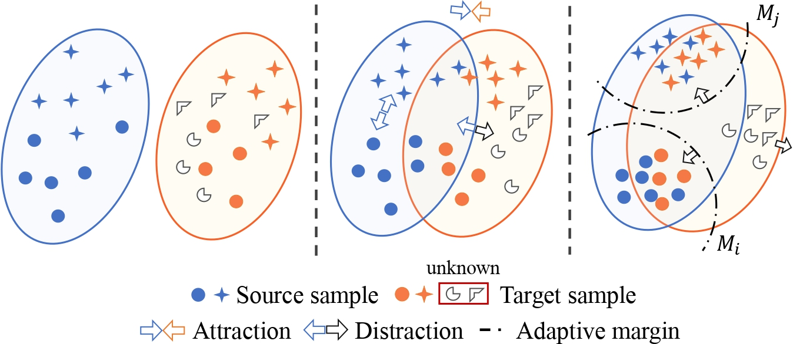
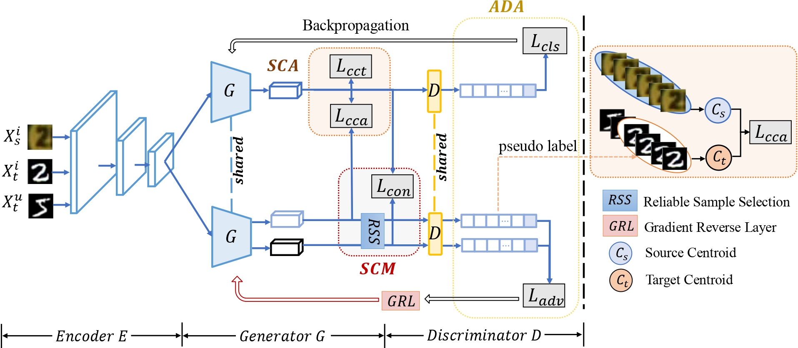
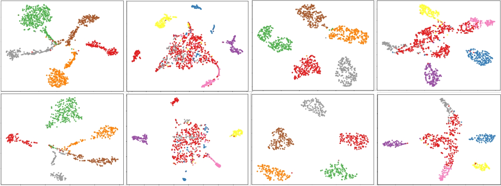

# Margin-Openset
This is the implementation of [Attract or Distract: Explore the Margin of Open Set](https://openaccess.thecvf.com/content_ICCV_2019/html/Feng_Attract_or_Distract_Exploit_the_Margin_of_Open_Set_ICCV_2019_paper.html) (ICCV 2019). 


### Framework


***
### Requirements

- Pytorch 0.4
- scikit-learn

### Usage
SVHN -> MNIST
```
python train.py --task s2m --gpu 0 --epochs 100
```
USPS -> MNIST
```
python train.py --task u2m --gpu 0 --epochs 100
```
MNIST -> USPS
```
python train.py --task m2u --gpu 0 --epochs 100
```

***
### digit-TSNE


***
### Bibtex

Give a ⭐️ if this project helped you, please also consider citing our work:
```
@InProceedings{Feng_2019_ICCV,
author = {Feng, Qianyu and Kang, Guoliang and Fan, Hehe and Yang, Yi},
title = {Attract or Distract: Exploit the Margin of Open Set},
booktitle = {Proceedings of the IEEE/CVF International Conference on Computer Vision (ICCV)},
month = {October},
year = {2019}
}
```


